# Lab 1 - Baseline Models Report

## Results Summary

| Dataset       | Model        | Accuracy | Precision (Macro) | Recall (Macro) | Note    |
| ------------- | ------------ | -------- | ----------------- | -------------- | ------- |
| **Accidents** | NaiveBayes   | 0.8213   | 0.88              | 0.80           | Success |
| **Accidents** | KNN          | 0.7800   | 0.81              | 0.73           | Success (Sampled: 1000 train) |
| **Accidents** | DecisionTree | **0.8300** | **0.87**        | **0.81**       | Success |
| **Accidents** | LogReg       | 0.8600   | 0.90              | 0.82           | Success (Sampled: 1000 train) |
| **Accidents** | MLP          | 0.8667   | 0.90              | 0.82           | Success (Sampled: 1000 train) |
| **Flights**   | NaiveBayes   | 0.9338   | 0.92              | 0.87           | Success |
| **Flights**   | KNN          | 0.7733   | 0.66              | 0.54           | Success (Sampled: 1000 train) |
| **Flights**   | DecisionTree | **0.9400** | **0.93**        | **0.90**       | Success |
| **Flights**   | LogReg       | 0.9767   | 0.97              | 0.96           | Success (Sampled: 1000 train) |
| **Flights**   | MLP          | 0.7700   | 0.39              | 0.50           | Success (Sampled: 1000 train) |

---

## Accidents Dataset

### Final Model Comparison

#### Accuracy Comparison
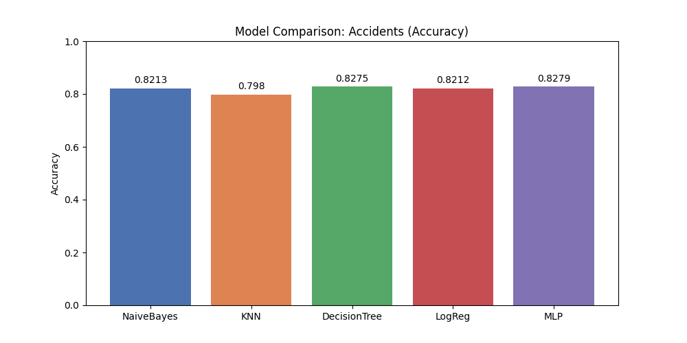

#### Precision Comparison
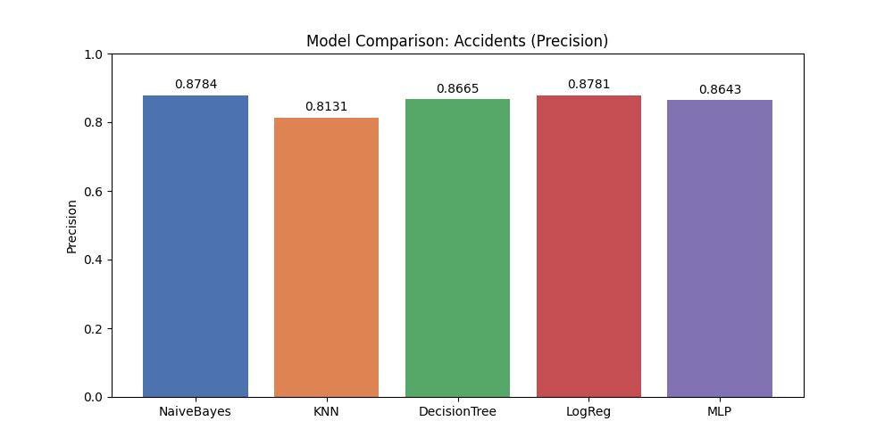

#### Recall Comparison
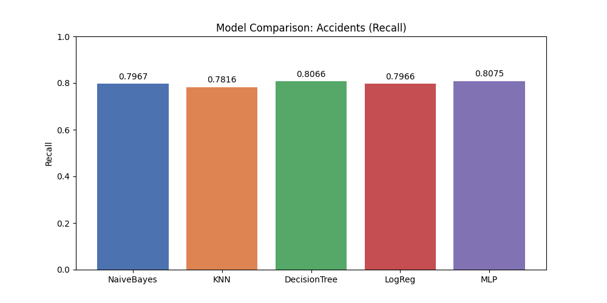

### Naive Bayes Study

#### Accuracy

#### Precision

#### Recall

### KNN Study

#### Accuracy

#### Precision

#### Recall

### Decision Tree Study

#### Accuracy

#### Precision

#### Recall

### Logistic Regression Study

#### Accuracy

#### Precision
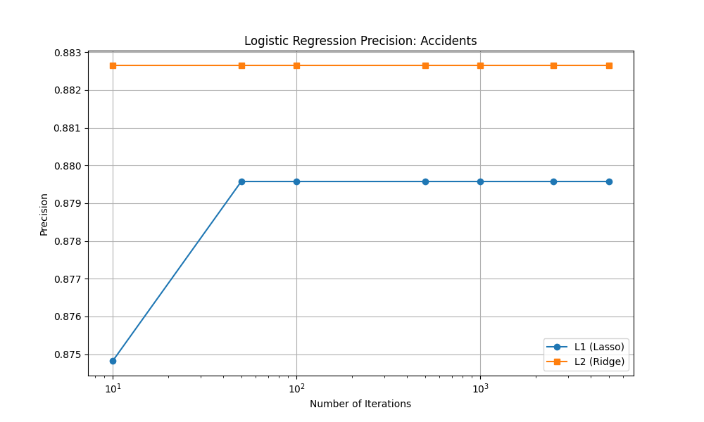

#### Recall
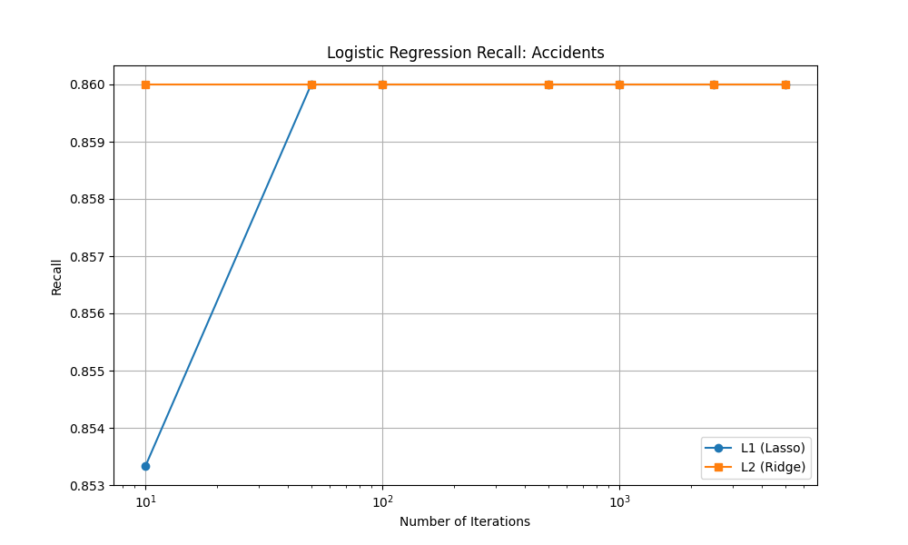

### MLP Study

#### Adaptive Learning Rate - Accuracy
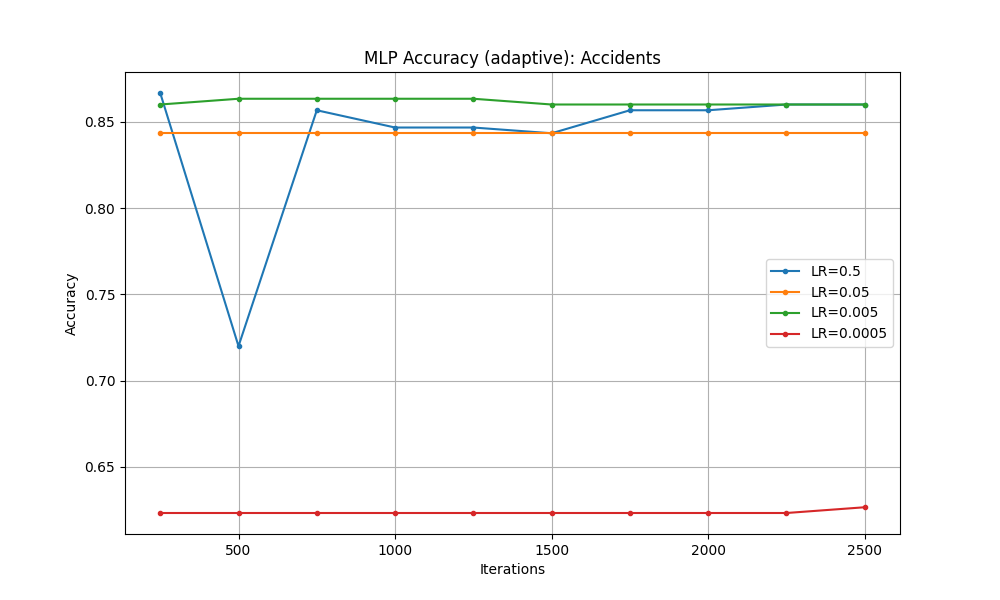

#### Adaptive Learning Rate - Precision

#### Adaptive Learning Rate - Recall

#### Constant Learning Rate - Accuracy

#### Constant Learning Rate - Precision

#### Constant Learning Rate - Recall

#### Inverse Scaling Learning Rate - Accuracy

#### Inverse Scaling Learning Rate - Precision

#### Inverse Scaling Learning Rate - Recall

---

## Flights Dataset

### Final Model Comparison

#### Accuracy Comparison

#### Precision Comparison
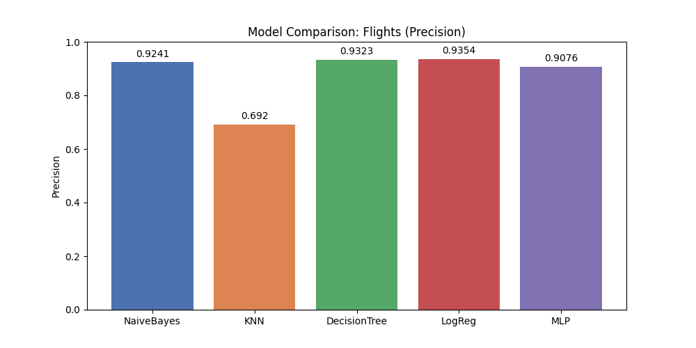

#### Recall Comparison

### Naive Bayes Study

#### Accuracy
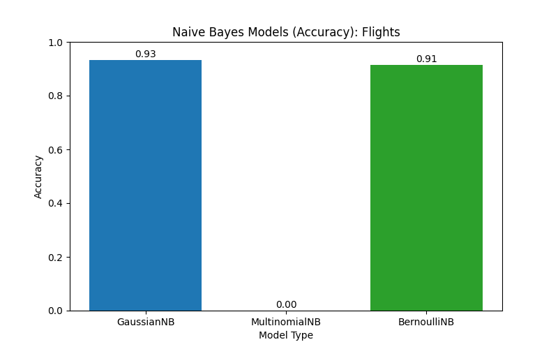

#### Precision

#### Recall

### KNN Study

#### Accuracy

#### Precision
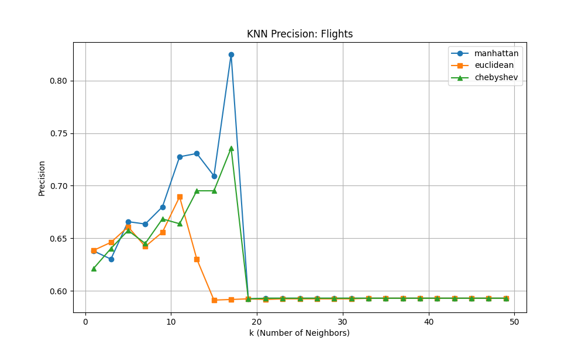

#### Recall

### Decision Tree Study

#### Accuracy

#### Precision
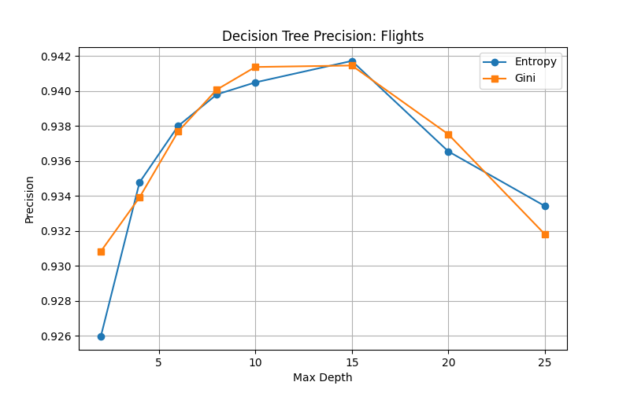

#### Recall

### Logistic Regression Study

#### Accuracy

#### Precision

#### Recall

### MLP Study

#### Adaptive Learning Rate - Accuracy

#### Adaptive Learning Rate - Precision
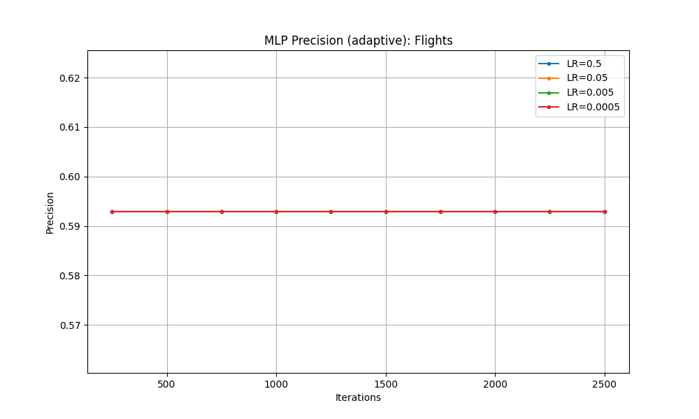

#### Adaptive Learning Rate - Recall

#### Constant Learning Rate - Accuracy

#### Constant Learning Rate - Precision
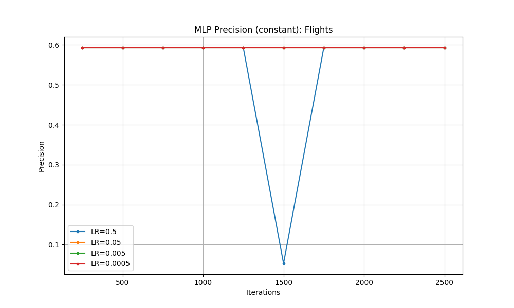

#### Constant Learning Rate - Recall

#### Inverse Scaling Learning Rate - Accuracy

#### Inverse Scaling Learning Rate - Precision

#### Inverse Scaling Learning Rate - Recall
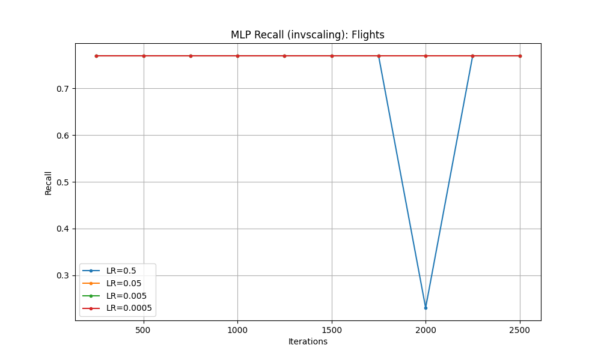
